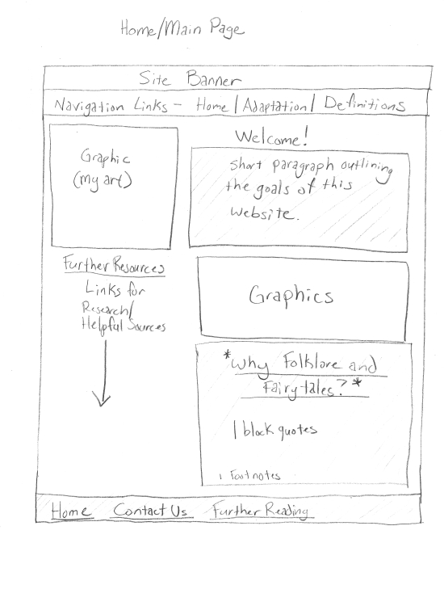
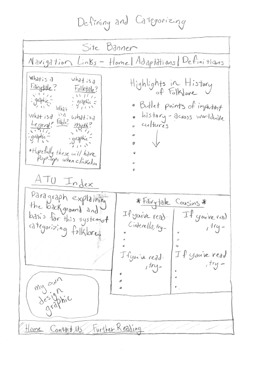
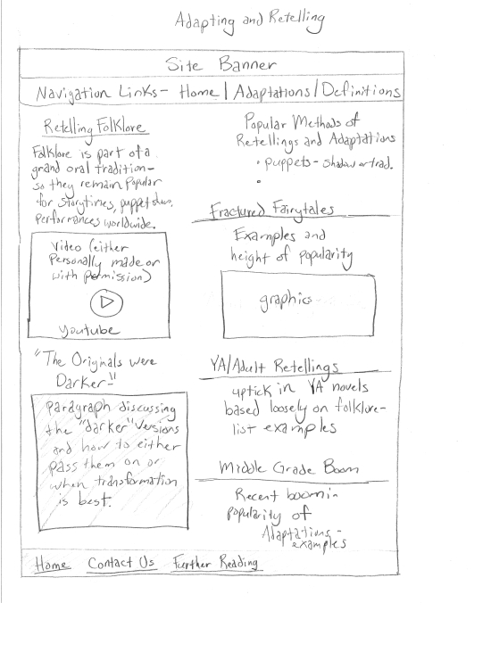

# INF6420 Project Hannah Shumway

A site serving as a brief introduction to folklore.

## Wireframes

These are some basic layouts of how the website will hopefully look upon completion. 

Header- This will serve as the site banner which will feature my own graphics.

Navigation Bar- this will include links for the home page as well as the other two main pages I'm planning, defintions and adaptations.

Main Content- For this home page, it will mostly be a welcome and brief overview of the goals of the website.

Footer- will include a few additional links, back to home, contact information, and any necessary copyright information.

Header- This will serve as the site banner which will feature my own graphics.

Navigation Bar- this will include links for the home page as well as the other two main pages I'm planning, defintions and adaptations.

Main Content- For this page, there will be a bulleted list of important historical moments for folklore influence/collection. There will also be boxes for the ATU folklore index definitions, and hopefully interactive features depicting the different types of folklore and stories that relate to one another. 

Footer- will include a few additional links, back to home, contact information, and any necessary copyright information.

Header- This will serve as the site banner which will feature my own graphics.

Navigation Bar- this will include links for the home page as well as the other two main pages I'm planning, defintions and adaptations.

Main Content- For this page, there will be some varying types of presenting folklore and adapating it, as well as an embed YouTube video example of retelling folklore for different audiences. 

Footer- will include a few additional links, back to home, contact information, and any necessary copyright information.